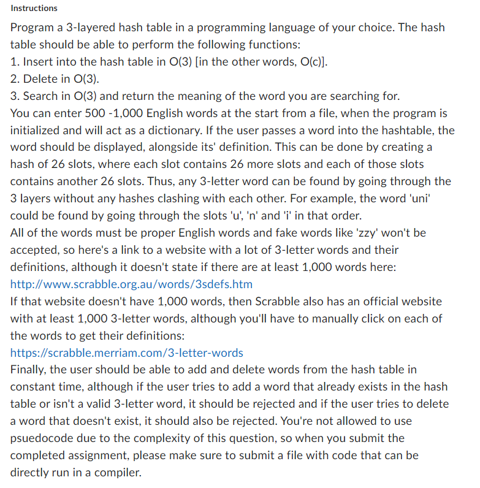

<!-- Template version 1.0
-->
<a name="readme-top"></a>

<!-- PROJECT LOGO -->
<br />
<div align="center">
  <a href="https://github.com/BrandonNNiles/Hashmap-Dictionary">
    
  </a>

  <h3 align="center">3-Letter Hashmap Dictionary</h3>

  <p align="center">
    CP-312 Fall 2022
    <br />
    <a href="https://github.com/BrandonNNiles/Hashmap-Dictionary"><strong>Project Repo</strong></a>
  </p>
</div>


<!-- ABOUT THE PROJECT -->
## About The Project


This project is an assignment submission for CP-312 Fall 2022. The goal of this assignment is to create a hashmap implemntation for a 3-letter dictionary.

##### Noteable Features:
* Hash class
    * Insert
    * Search
    * Delete
* Auto-loading of example words
* Console-based host commands (ability to execute commands from a terminal)
    * Ability to add custom console-commands with little coding
* Unit-test cases included

#### Submission Requirements



<p align="right">(<a href="#readme-top">back to top</a>)</p>


### Built With

The following languages, tools, and frameworks were used to develop the project:

* Python3

<p align="right">(<a href="#readme-top">back to top</a>)</p>


<!-- GETTING STARTED -->
## Getting Started

Follow the below steps to run the application.

### Requirements

This application has no dependancies.

### Operation


1. Execute the file `src/main.py`
2. Execute commands via the terminal window. Type `/help` for more info.


<p align="right">(<a href="#readme-top">back to top</a>)</p>


<!-- USAGE EXAMPLES -->
## Usage
The main purpose of the application is to implement a 3-letter hashmap dictionary with user input via the console.

### Console Commands
The following are a set of currently implemented commands that can be executed through the application's terminal.
```
Command          Arguments                      Description
-------          ---------                      -----------
/delete          [Word]                         Attempts to delete a word from the hashtable.
/help            [None]                         Displays all commands available.
/insert          [Word Definition]              Attempts to insert a definition to a word into the hash table.
/quit            [None]                         Ends the process.
/search          [Word]                         Searches for a definitinon in the hash table.
```

<p align="right">(<a href="#readme-top">back to top</a>)</p>


<!-- LICENSE -->
## License

Distributed under the MIT License. See `LICENSE.txt` for more information.

<p align="right">(<a href="#readme-top">back to top</a>)</p>

## File Overview

- `console.py` - Console and command implementation. 
- `hash.py` - Hashmap class implementation and methods.
- `helper_methods.py` - Additional non-core methods that `hash.py` relies on.
- `main.py` - Main executable.
- `mass_load.py` - Loads in a large number of 3-letter words into the dictionary for initialization.
- `tests.py` - A full-set of unit-test cases for testing the hash implementation.


<!-- CONTACT -->
## Contact

Brandon Niles - [LinkedIn](https://www.linkedin.com/in/brandonnniles/) - brandonniles00@gmail.com

<p align="right">(<a href="#readme-top">back to top</a>)</p>

